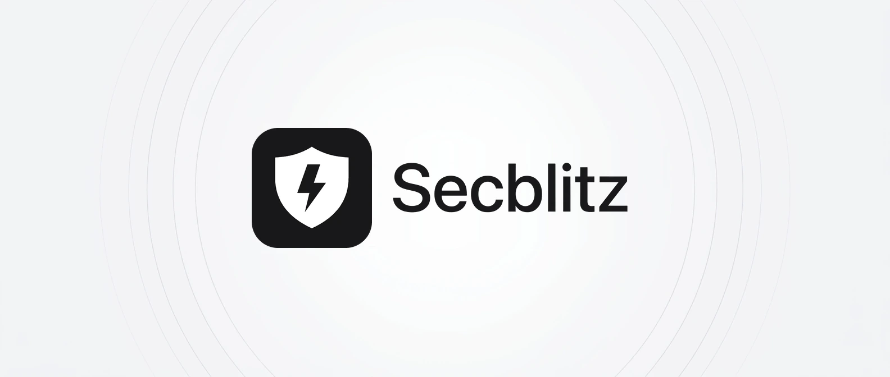
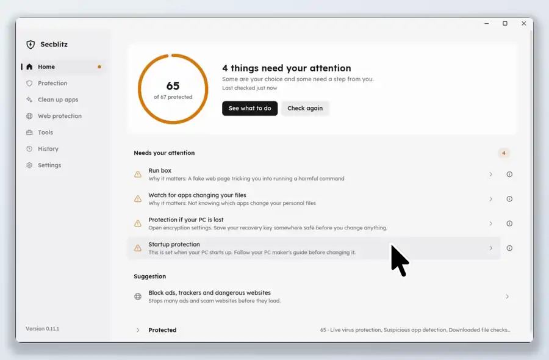

<div align="center">

<picture>
  <source media="(prefers-color-scheme: dark)" srcset="docs/banner-dark.webp">
  
</picture>

Secblitz turns on the security and privacy settings Windows leaves off, in one click. It also removes bloatware and blocks ads, trackers and malware sites on your whole PC. Every change can be undone.

[**Download for Windows**](https://secblitz.lol/downloads/secblitz-1.0.0-windows-x64-setup.exe) · [Website](https://secblitz.lol) · [Security](SECURITY.md) · [Contributing](CONTRIBUTING.md)

   [](https://secblitz.lol/#download)



</div>

## How it works

1. **Check.** Secblitz looks at your Windows settings and shows which ones could be safer. It takes about a minute and changes nothing.
2. **Review.** Each setting says what it protects against and what changes for you.
3. **Fix.** One click fixes everything you approved. Secblitz then confirms each fix worked.
4. **Undo.** Every change is recorded. History puts your old settings back.

## Features

- **One-click fixes** for more than 50 security and privacy settings: virus protection, firewall and network, sign-in, updates, startup, disk and privacy. Anything already secure is left alone.
- **Bloatware removal.** Removes unwanted apps that came with Windows. Secblitz keeps a copy of each, so you can restore it later, even offline.
- **Ad and malware blocker.** Blocks ads, trackers and malware sites in every browser and app.
- **Background monitoring.** Tells you if your protection gets worse.
- **History** of every change and every removed app.
- **Six languages:** English, Spanish, French, German, Portuguese and Italian. Light and dark mode.

Secblitz only looks at settings on this PC and changes them with your approval. It does not look at other devices, list open ports or test passwords.

Secblitz is not an antivirus. It turns on and configures the protection built into Windows, and it leaves third-party antivirus and PCs managed by work or school alone.

## Install

Download the [installer](https://secblitz.lol/downloads/secblitz-1.0.0-windows-x64-setup.exe) (about 9 MB) and run it. For a PC with an ARM processor, like a Snapdragon laptop, use the [ARM installer](https://secblitz.lol/downloads/secblitz-1.0.0-windows-arm64-setup.exe) instead. Secblitz asks for administrator permission because it reads and changes system settings.

The installer is not code-signed yet, so Windows may show an unknown publisher warning. Choose **More info**, then **Run anyway**. To check the file, compare its SHA-256 with the one on the [download page](https://secblitz.lol/#download):

```powershell
Get-FileHash .\secblitz-1.0.0-windows-x64-setup.exe -Algorithm SHA256
```

Each release also has a parts list (`.cdx.json`) on its [GitHub release page](https://github.com/secblitz/Secblitz/releases) that names every piece of code Secblitz is built from.

Using Secblitz 0.9.2 or older with Web protection on? It can't update itself to a newer version. Download and run the installer once; your settings, history and undo stay.

## Supported Windows

| Windows | Edition | Version | Processor | Supported | Tested |
| --- | --- | --- | --- | --- | --- |
| Windows 11 | Home | 24H2 | x64 | ✓ | Not yet |
| Windows 11 | Pro | 25H2 | x64 | ✓ | Not yet |
| Windows 11 | Enterprise | 24H2 | x64 | ✓ | ✓ 0.12.0 |
| Windows 11 | Pro | 24H2 | ARM | ✓ | Not yet |
| Windows 10 | Enterprise | 22H2 | x64 | ✓ | Not yet |

Secblitz supports Windows 10 version 22H2 and Windows 11. Microsoft stopped free security updates for Windows 10 on 14 October 2025 and Secblitz cannot replace them, so moving to Windows 11, or Microsoft's Extended Security Updates, keeps a Windows 10 PC safest.

## Uninstall

Open **Settings**, then **Apps**, then **Installed apps** (on Windows 10: **Apps**, then **Apps and features**). Find Secblitz and choose **Uninstall**. Secblitz asks whether to keep your PC as it is now or put everything back the way it was. Either way, it removes itself.

You can also open Secblitz, go to **Settings** and choose **Remove Secblitz from this PC**. If you use the portable version, do that to put your settings back, then delete the `secblitz.exe` file.

## Build from source

On Windows 11, install:

- [Rust](https://rustup.rs) (the pinned compiler in `rust-toolchain.toml` is selected automatically)
- [Visual Studio Build Tools](https://visualstudio.microsoft.com/downloads/) with "Desktop development with C++"
- [Inno Setup 6.4 or later](https://jrsoftware.org/isinfo.php), only for the installer

```powershell
git clone https://github.com/secblitz/Secblitz.git
cd Secblitz

# The app only: target\release\secblitz.exe
cargo build --locked --release

# Tests, the app and the installer: dist\
powershell -ExecutionPolicy Bypass -File scripts\build-release.ps1
```

To build the Windows app from Linux, see [CONTRIBUTING.md](CONTRIBUTING.md).

## Privacy

No account, no ads, no telemetry. Secblitz goes online to update itself (if updates are on), for actions you start, and to download block lists if web protection is on. See the [privacy policy](https://secblitz.lol/privacy.html).

## Code signing policy

Free code signing provided by SignPath.io, certificate by SignPath Foundation. Releases are built from this repository by GitHub Actions, and each signing request is approved by hand. Read the full [Code signing policy](docs/CODE_SIGNING.md), also on the [website](https://secblitz.lol/code-signing.html).

## Security and contributing

For how well Secblitz works with the keyboard and other ways of using a PC, see the [accessibility statement](docs/ACCESSIBILITY.md). For what is planned, see the [roadmap](docs/ROADMAP.md). To report a security problem, see [SECURITY.md](SECURITY.md). To build Secblitz or send a change, see [CONTRIBUTING.md](CONTRIBUTING.md).

## License

[MIT](LICENSE). Fonts, icons, libraries and block lists from others are credited in [THIRD-PARTY-NOTICES.md](THIRD-PARTY-NOTICES.md).
