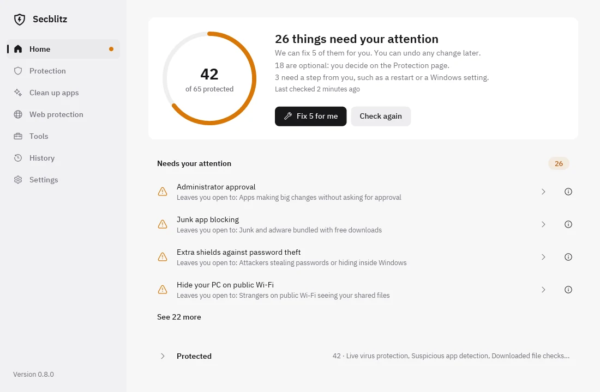

<div align="center">

# Secblitz

**A safer PC, without the headaches.**

Security, privacy and cleanup for Windows, all in one app.

Secblitz checks your Windows PC, tells you in plain language what needs fixing, and fixes it when you say yes. You don't need to know anything about computers.

[**Download for Windows**](https://secblitz.lol/downloads/secblitz-0.8.1-windows-x64-setup.exe) · [Website](https://secblitz.lol) · [Security](#security) · [Contributing](#contributing)

  

<picture>
  <source media="(prefers-color-scheme: dark)" srcset="website/assets/app-home-dark.webp">
  
</picture>

</div>

## Why Secblitz

Windows has strong security and privacy settings, but many are turned off by default and spread across menus written for IT professionals. Secblitz brings security, privacy and PC upkeep together in one app made for people without technical knowledge:

1. **Check.** One click looks at your antivirus, firewall, sign-in, updates and more. About a minute, and nothing is changed.
2. **Choose.** Every check says what it does, what could go wrong without it and what you'll notice once it's on, downsides included.
3. **Fix.** Say yes once. Secblitz applies your choices, then checks again to make sure each one really took.
4. **Undo.** Your original settings are saved first. History puts them back with one click.

## What's inside

- **More than 50 checks** across virus protection, network and Wi-Fi, sign-in and accounts, updates, startup and disk, and privacy. Protection you already have is recognized, so nothing changes for the sake of it.
- **Clean up apps.** Remove the apps Windows came with that you never use. Secblitz keeps a copy of each one, so you can bring it back any time, even without internet.
- **Tools.** Microsoft Defender scans and protection updates, Windows repair, security updates, PC health tips, a password maker and an optional Bitwarden install.
- **Background checks.** Secblitz can keep an eye on your PC from the notification area and tell you if something changes.
- **History.** How your protection changed over time, every change made, and every app removed.
- **Six languages** (English, Spanish, French, German, Portuguese, Italian), light and dark mode.

Secblitz is not an antivirus. It makes sure the protection Windows already gives you is switched on and set up well, and it leaves third-party antivirus settings and PCs managed by work or school alone.

## Install

Download the [installer](https://secblitz.lol/downloads/secblitz-0.8.1-windows-x64-setup.exe) (8.5 MB) and run it. Secblitz asks for administrator permission when it opens, because reading and changing security settings needs it.

The installer is not code-signed yet, so Windows may say the publisher is unknown. Choose **More info**, then **Run anyway**. To confirm you have the exact published file, compare its SHA-256 with the one on the [download page](https://secblitz.lol/#download):

```powershell
Get-FileHash .\secblitz-0.8.1-windows-x64-setup.exe -Algorithm SHA256
```

Tested on Windows 11, 64-bit. Windows 10 is not tested.

## Security

A tool that changes security settings has to be held to a higher bar than the settings it changes. What Secblitz promises:

- **Nothing changes without a yes.** A check is read-only. Fixes run only for the exact list you approved, and settings that are a matter of taste are never pre-selected.
- **A fixed menu, not a remote control.** Secblitz can only touch the settings compiled into it. It never runs commands, scripts or downloads chosen at run time, and anything passed between the elevated window and your normal account is a fixed request code, never a path or a command.
- **Undo you can trust.** Original values are written to a local journal before every change, and History restores them newest first. It does not undo Windows updates, app installs or changes made outside Secblitz.
- **Signed updates.** Updates are checked against an Ed25519 public key pinned in the app, plus the installer's exact size and hash. Older releases are refused, so an attacker can't roll you back to a vulnerable version. Updates never close the app while you use it and never restart your PC.
- **Nothing leaves your PC.** No account, no ads, no telemetry. The internet is used only for Secblitz updates and downloads you ask for.

Known limits: the executables are not Authenticode-signed, so trust in the first download rests on HTTPS and the published checksum. Windows 10, Home and Pro editions and many hardware setups are not yet tested.

### Reporting a vulnerability

Please **don't open a public issue** for security problems. Email **[support@secblitz.lol](mailto:support@secblitz.lol)**, or use GitHub's private reporting: **Security → Report a vulnerability** on this repository. Include the Secblitz version, your Windows version and steps to reproduce. We aim to reply within a week, and to ship a fix or give a clear answer before anything is made public. Reports about the updater, the elevated process, undo, or anything that could let another user or program change your settings are especially welcome.

Deeper reading: [security model](docs/security-model.md), [update contract](docs/update-contract.md), [security review](docs/SECURITY-REVIEW.md). These were written for earlier releases; the guarantees above are the current ones.

## Contributing

Bug reports, translations and fixes are all welcome. For anything bigger than a small fix, open an issue first so we can agree on the approach.

**Build and test**

```sh
# Portable logic and tests, on any OS
cargo test --locked --all-targets

# The Windows app (from Linux, with a MinGW-w64 toolchain)
cargo build --locked --release --target x86_64-pc-windows-gnu
cargo clippy --locked --target x86_64-pc-windows-gnu --all-targets -- -D warnings
```

On Windows, `scripts/build-release.ps1` runs the same tests, lint and build with MSVC and compiles the installer. CI runs it on every push, along with a RustSec audit of `Cargo.lock`. Releases are built from source by GitHub Actions: see [docs/RELEASING.md](docs/RELEASING.md) and the [changelog](CHANGELOG.md).

**House rules**

- **Plain words.** The app is for people who don't know what a firewall profile is. No acronyms, no fear, no em dashes in user-facing text.
- **Every check explains itself.** A new check needs its what it is / if it's off / if you turn it on text in [`src/explain/`](src/explain/).
- **Every string in six languages.** Add translations to [`src/i18n.rs`](src/i18n.rs), or drop them in [`i18n-pending/`](i18n-pending/) if you only speak some of them.
- **Reversible or read-only.** A change Secblitz makes must record what it replaced and be undoable, or be clearly labeled as one-way before the user says yes.
- **Tests with the change.** Run the tests and clippy before you open a pull request, and say in the description what you tested on a real Windows PC.

Maintainers and coding agents: the full working rules are in [AGENTS.md](AGENTS.md).

## License

[MIT](LICENSE). Secblitz is free and stays free. Fonts, icons, libraries and block lists from others are credited in [THIRD-PARTY-NOTICES.md](THIRD-PARTY-NOTICES.md).
