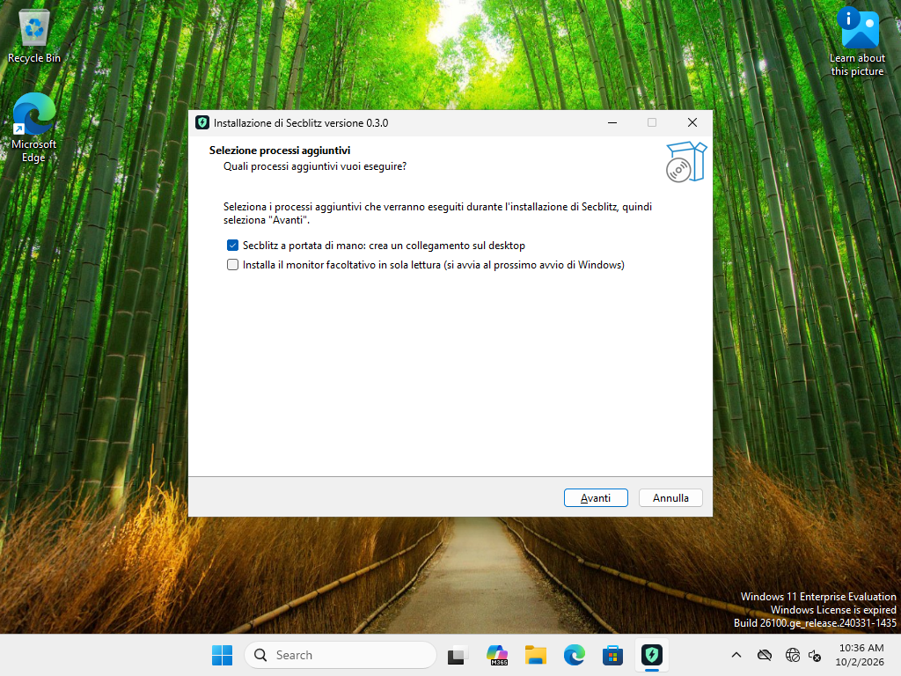
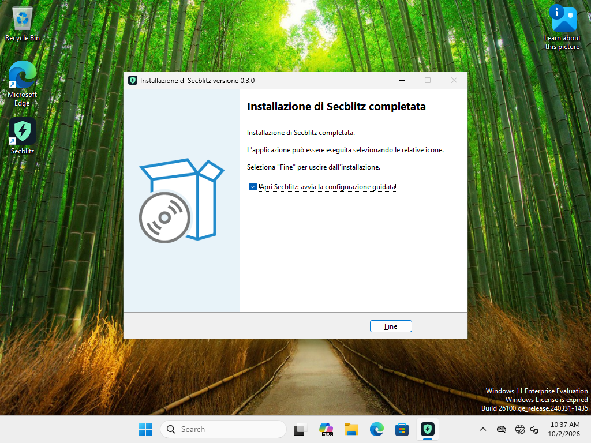
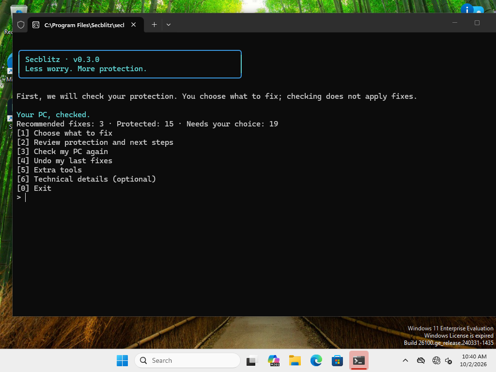
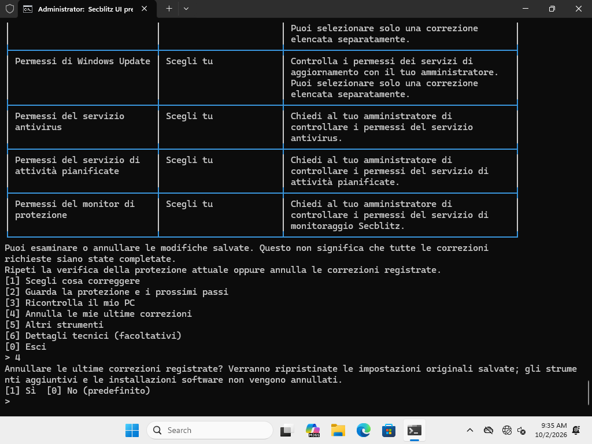
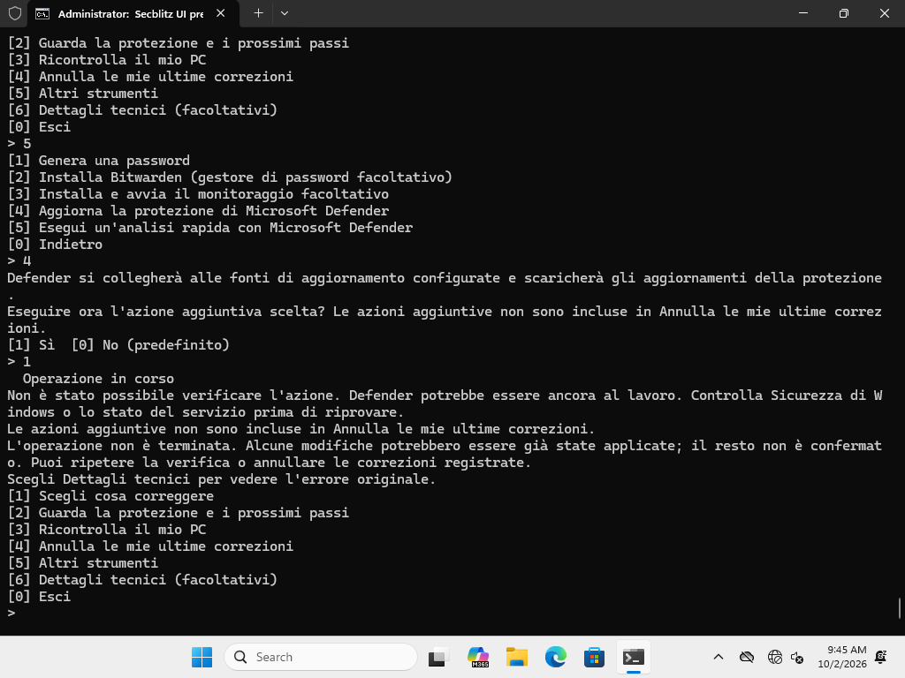
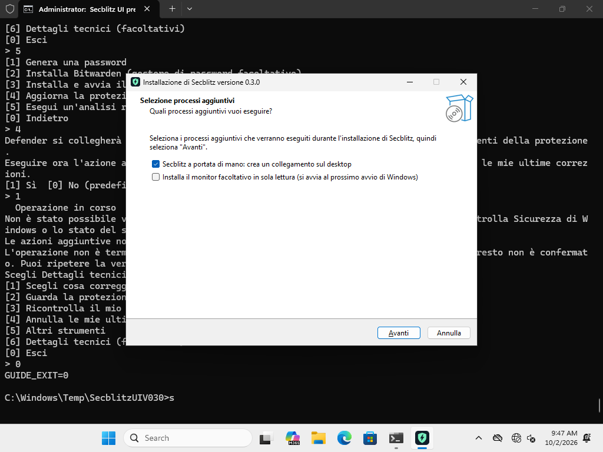
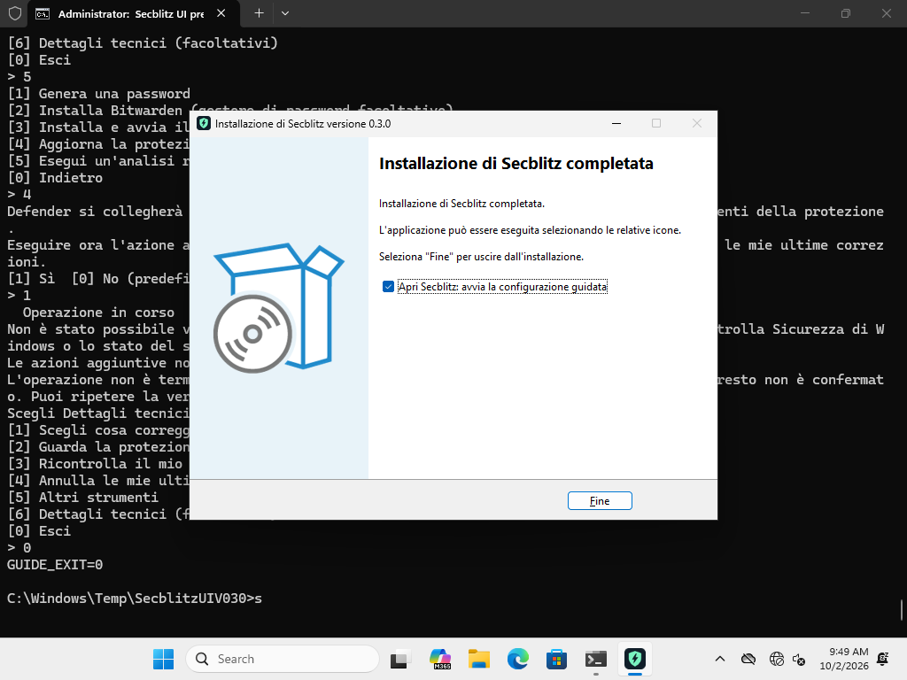
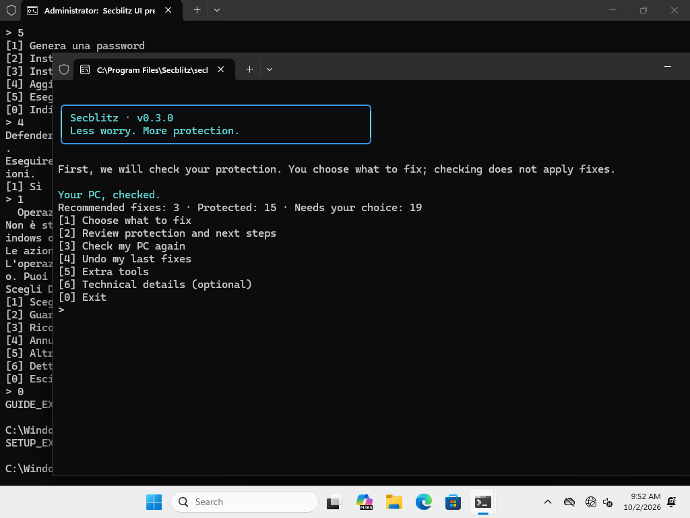

# Secblitz v0.3 - Windows final acceptance

## Final pause-fixed release - PASS (authoritative)

**The hidden-pause blocker is fixed and the exact rebuilt 0.3.0 package passed native regression, full installer lifecycle and final GUI smoke testing.** Only `Secblitz-W11-UI-Test` was used. The user's active VM was untouched. No product source was edited by this tester.

### Promoted artifacts

`dist/SHA256SUMS` contains only the current tested pair, and checksum verification passed:

```text
5762aa166c789523e663b3eeb98867dc9f8ef6f5fc3ea1aa636e09933801d8d1  secblitz.exe
db4cdd4a5c824626fb91b43adf5b06eb454463b89114bd0ef60740324b711195  secblitz-0.3.0-windows-x64-setup.exe
```

The previously tested 0.2.0 executable, installer and checksum file are preserved and independently verified in **`dist/archive/0.2.0/`**. These remain unsigned GNU-cross-built development artifacts; this test does not establish signing/native-MSVC provenance or Windows 10 compatibility.

### Narrow regression results

| Check on the rebuilt bytes | Result |
| --- | --- |
| Native Windows library tests | **83 passed**, exit 0 |
| Native Windows CLI tests | **41 passed**, exit 0 |
| New `captured_workers_never_wait_for_an_invisible_prompt` test | Passed |
| `service status`: console stdin inherited, stdout/stderr captured | **exit 0 in 647 ms**, no pause prompt, no forced termination |
| Same command with stdin closed | **exit 0 in 41 ms**, no pause prompt, no forced termination |

The Inno-hosted regression recorded `ParentStdinConsole=true`, preserving the relevant mixed-stdio context. Its tiny diagnostic installer intentionally aborts initialization (launcher exit 1); **both actual application probes exit 0**. This is not a production setup failure.

### Full production installer lifecycle on the exact final package

The unmodified repository `installer/test-lifecycle.ps1` completed with **exit 0**:

| Stage | Observed result |
| --- | --- |
| Default silent install / uninstall | **0 / 0**; desktop shortcut created/removed, monitor absent, no app UI launched |
| `/TASKS=""` install / uninstall | **0 / 0**; desktop and monitor opted out, no app UI launched |
| Fresh `/TASKS=monitor` install | **0**, about **5.85 seconds** from installer log open to close |
| Monitor start / first completed report | Running as LocalService; schema 1, **18 observations / 19 findings**, incomplete=false |
| Upgrade while running with `/TASKS=""` | **0**; monitor resumed Running; desktop remained opted out |
| Deliberately locked unrelated `unins001.dat` | Uninstall **1**, expected fail-closed rejection; no modal hang, installation/running service preserved |
| Unlock and uninstall while running | **0**; binary, service and owned shortcut absent; report, journal sentinel and unrelated files preserved |

Original real journals were moved aside intact for the clean-runner lifecycle, then restored. Their hashes before/after match exactly. Lifecycle-only benign preservation fixtures/report evidence were moved out of Program Files, and the prior retained app data was restored. **All 18 baseline captures match exactly.**

### Exact-final-byte GUI smoke

The final package was additionally opened with `/LANG=it`. Actual screenshots show desktop checked and monitor unchecked on the tasks page, and guided launch checked on Finish. The installed executable hash matched `5762aa...01d8d1` exactly. The installed guide scanned and waited without a choice; all 18 values remained unchanged. After selecting Exit, uninstall returned **0**. Original journal hashes were again unchanged, using the existing pre-GUI lifecycle capture for comparison.







### Scope, evidence and final state

- The earlier candidate's successful selected-public-firewall batch, later UAC-only batch, reverse-order undo and explicit optional-action tests remain documented below. **Those mutation fixtures were not repeated:** the coordinated change was limited to pause handling, with the engine/backend unchanged. New fixed-byte tests cover the regression, native suites, full production lifecycle and GUI no-input preservation.
- Native original-nonadmin UAC/settings-broker flow remains explicitly unvalidated. Windows 10 remains untested. No Defender disabling, broad extra tests or fake interactive TTY were used.
- Final state: **no installed executable, no app process, no monitor service, no owned desktop shortcut**, and no unsafe fixture. All 18 controls are baseline-identical; original journals are retained. UI clone is running/offline; original user VM and other VMs were untouched.
- Main evidence: `/tmp/opencode/secblitz-v030-pause-fixed-results/` and its ZIP; lifecycle logs are specifically `LifecycleLogs/SecblitzLifecycle-3746c04b4fe043fd9e8dc6a9bdd11255/`.
- Exact-byte GUI evidence: `/tmp/opencode/secblitz-v030-fixed-gui/` and its ZIP. `/tmp/opencode/secblitz-v030-check-fixed-evidence.py` independently verified the 124-test counts, report counts, exact installed hash, all-18 equality, journal hashes and clean final state.
- The earlier blocked candidates and screenshots below are historical, not the current release status or hashes.

---

## Earlier candidate result: pause blocker (resolved above)

The final supplied executable was tested, not the earlier readiness candidate. **Native tests, real-console selected batches/undo, guided monitoring, and interactive installer defaults passed. Silent optional-monitor installation exposed a confirmed noninteractive pause regression.** No product source was edited by this tester, and no failing candidate was promoted to the website/current `dist` release.

| Tested artifact | SHA-256 |
| --- | --- |
| Final supplied `secblitz.exe` | `b4739e7055cf79e4cd1482f830bc6593303cba27e097c587f53364a83de31eb4` |
| Actual Inno 0.3.0 candidate installer | `2549fa0c20454bd3ba4dc105124db07b85c61e4a37963173e9c44c18ddf7ae7a` |

Both candidate files are retained in `/tmp/opencode/secblitz-v030-candidate/`. Existing passing v0.2.0 distribution files/checksums were not replaced. The user-owned `Secblitz-W11-Test` was never operated on; all execution/input/cleanup below was confined to **Secblitz-W11-UI-Test**.

### Confirmed blocker: hidden maintenance waits for Enter

`installer/test-lifecycle.ps1` passed default desktop installation/removal and explicit desktop opt-out, then **optional-monitor setup exited 20** after about **180 seconds**. The native install had registered a stopped monitor, but its child remained running as:

```text
"C:\Program Files\Secblitz\secblitz.exe" service install
```

Read-only reproduction in the same hidden Inno/PowerShell launch context:

| `service status` launch | Result |
| --- | --- |
| stdout/stderr redirected; terminal stdin inherited | Prints `Complete` and **`Press Enter to close`**, does not exit within 7 seconds; diagnostic terminated this read-only child |
| Same executable/arguments; stdin redirected and closed | **exit 0** without termination |

The source cause is `main.rs` enabling pause for non-guide, non-JSON commands based on `ui::owns_console()`, while `ui::pause` checks only stdin. The installer redirects output but leaves stdin inherited. The condition permits a hidden input wait even after the business operation succeeds. A fix must prevent this pause for noninteractive streams (and/or defensively close maintenance stdin), followed by a rebuilt-artifact lifecycle rerun. Closing stdin was used only for the controlled diagnostic and cleanup - not as a claimed passing production-installer workaround.

Evidence: `/tmp/opencode/secblitz-v030-pause-probe/`, especially `pause-probe.jsonl`, `pause-stdin-inherited.err`, and `orphan-command.json`. The diagnostic performs only `service status` and aborts its own tiny Inno setup before installation. The actual failed lifecycle log is under `SecblitzLifecycle-8ea79d1970624da496a8443a7779d96a` in `/tmp/opencode/secblitz-v030-final-package-results/` (some copied folders are nested). Source lifecycle assertions after the failed monitor opt-in stage were not reached and are not claimed as passed.

### Final native tests

- **83 Windows library tests passed**, exit 0.
- **40 Windows CLI tests passed**, exit 0, including actual terminal-guard tests under redirected native execution.
- Total: **123 native Windows tests**. The coordinating host reported 119 host tests; host/native counts differ by platform-specific tests.
- Final binaries used the requested `5e38bc0a11864a11` / `1167b63be0b0ad32` test executables. Old readiness localization failures below do not describe this final test run.

### Actual-console selected batches and undo - passed

Tests used an actual Windows terminal at a 1024×768 desktop, with keyboard input and screenshots. No fabricated TTY or piped guide input was used. All 18 preferences/descriptors were captured independently.

| Stage | Public firewall Enabled | UAC administrator consent | Other 16 controls |
| --- | --- | --- | --- |
| Original baseline | True | DWORD 5 | Baseline |
| Deliberate fixtures | False | DWORD 0 | Unchanged |
| Empty selection / declined confirmation | False | 0 | Unchanged |
| Batch 1: select **only Public Enabled** | **True** | **0, not selected** | Unchanged |
| New guide session, batch 2: select **only consent** | True | **5** | Unchanged |
| Undo latest batch | **True, earlier batch retained** | **0** | Unchanged |
| Undo earlier batch | **False** | 0 | Unchanged |
| Manual fixture cleanup | True | 5 | Exact original baseline |

Repeated observation confirmed only those two selected controls changed. The three recommended firewall inbound defaults remained NotConfigured throughout; they were never selected. Both new transactions were reverted, and history shows all five inherited/new transactions reverted. The guide exited 0. Invalid/empty selection and default-No confirmation did not mutate preferences.

Independent structural comparison passed using `/tmp/opencode/secblitz-v030-verify-stages.py`. Preserved host stage captures are `/tmp/opencode/secblitz-v030-after-firewall.json`, `secblitz-v030-after-uac.json`, `secblitz-v030-undo-uac.json`, and `secblitz-v030-undo-firewall.json`; the last is the capture made before manual baseline cleanup. Rolling guest captures can be replaced by later read-only inspections; the preserved host captures establish the intermediate fixture states.



### Explicit optional actions

- **Guided install/start monitoring passed after explicit consent.** Independently observed LocalService, Running, and a fresh schema-1 report newer than service startup: **18 observations / 19 findings**, incomplete=false. This does not assert all findings are healthy.
- **Guided Defender quick scan returned successfully.** Native quick-scan start/end timestamps advanced, with about 40 seconds between them. No claim of malware-prevention efficacy or a threat-free system is made.
- **Guided Defender update failed/was unverified with networking disabled.** The UI explicitly warned that Defender work may continue and instructed the user to review Windows Security. It did not claim fresh signatures or successful completion. Defender real-time/tamper protection stayed enabled.
- No Bitwarden download/install or password generation was performed.



### Actual Italian installer defaults and launch - passed

- Inno Setup 6.7.3 compilation: **exit 0**.
- Opened actual installer with `/LANG=it`, without silent flags.
- Tasks page: **desktop shortcut checked by default**, **optional monitor unchecked**.
- Finish page: **Open Secblitz checked by default**.
- Interactive installation: **exit 0**; desktop shortcut created.
- Finish launched the installed executable with `guide`. Its window was brought to the foreground for capture; it performed a scan and waited for a choice. With no selection/confirmation, all 18 controls remained equal to baseline.
- The installed guide used the Windows display language (English on this clone), while the installer was Italian. It was exited without applying anything.
- Current CLI help/about uses “A safer PC. Without headaches.”; the console banner still displays the secondary copy “Less worry. More protection.” This observed copy difference was reported; no source was changed.







### Silent lifecycle scope

The actual repository lifecycle script verified these stages before the blocker:

- Default silent install/uninstall **0/0**; desktop shortcut created and removed; no monitor by default.
- `/TASKS=""` silent install/uninstall **0/0**; no desktop shortcut and no monitor.
- No surviving application UI from those silent runs; source `skipifsilent` and logs are retained.
- `/TASKS=monitor`: **exit 20**, due to the hidden pause described above. Running-monitor upgrade/uninstall and rejection/retry stages of this v0.3 lifecycle were not reached.

### Original-user broker limitation

The desktop is the inherited Administrator account, so full original-nonadmin UAC elevation/re-consent/Settings dispatch was not established. A disposable standard-user public-API probe was attempted, but its process-launch harness failed before an API result was recorded. The account was removed; no protocol registry changes or credential disclosures occurred. Do not treat this as a passing original-user broker test. Native unit tests of the fixed exit-code/request/re-consent boundaries did pass.

### Cleanup and handoff

- Stopped only the verified orphan `service install` child in the UI clone.
- Removed the stopped monitor using a cleanup call with closed stdin: **exit 0**.
- Product uninstall after service removal: **exit 0**. This is cleanup, not a passing production optional-monitor uninstall.
- Independent final state: **no service, no installed executable, no shortcut, no Secblitz process, no disposable test account**.
- All 18 controls exactly match the original baseline; all transactions are reverted; original journal directory restored and retained.
- UI clone remains running/offline; user VM and all other VMs were not modified. Only the UI clone was restarted before fixtures to avoid its expired-evaluation shutdown interval. Windows 10 remains untested.

Evidence: `/tmp/opencode/secblitz-v030-final-clean-evidence/`, `secblitz-v030-pause-probe/`, `secblitz-v030-final-package-results/`, and screenshots embedded above. The next step is the narrow pause fix and exact rebuilt-installer lifecycle rerun, not another repetition of successful hardening fixtures.

---

## Historical pre-final candidate readiness

Date: 2026-10-02. **Ready for the final-build handoff.** This is preliminary read-only candidate/UI evidence, not release acceptance. No hardening action, optional-tool action, installer installation, or monitor installation was performed in this phase.

## Strict VM ownership boundary

The user is personally testing **Secblitz-W11-Test**. It received no guest command, keyboard input, screenshot request, restart, restore, stop, or configuration change during this task. Only its immutable powered-off snapshot metadata was read and that snapshot was cloned. Original BASE and all unrelated VMs were untouched.

All subsequent VM operations are pinned to the new **Secblitz-W11-UI-Test**:

| Property | Observed state |
| --- | --- |
| VM UUID | `4b70288b-b64d-4796-a725-006da3162d0f` |
| Snapshot source | `secblitz-pre-expanded-v020`, `c680e300-1a4a-47e8-b048-7777855b67df` |
| Clone method | `clonevm --snapshot ... --mode machine --register`, full independent clone |
| Disk | `/home/slay/Secblitz-W11-UI-Test/Secblitz-W11-UI-Test-disk1.vdi`; parent UUID `base`, no linked-clone dependency |
| Resources | 4 vCPUs, 4096 MiB RAM; host had about 14 GiB available before allocation |
| VM state | Running, headless VirtualBox frontend with an actual logged-on Windows desktop |
| Display | **1024×768×32** |
| Network / sharing | All eight NICs disabled; no shared folders; clipboard and drag-and-drop disabled; VRDE off |
| Guest | Windows 11 Enterprise Evaluation build 26200; Guest Additions 7.2.6 |
| Guest execution | Authenticated guest control succeeds |
| Compiler | Inherited Inno Setup present at `C:\Program Files (x86)\Inno Setup 6\ISCC.exe` |
| Defender | Real-time and tamper protection enabled |
| Installed product/service | None; temporary candidate only |

Desktop login used inherited authorized credentials, read only inside an ephemeral input helper and never printed, copied, or placed in command text. Reliable input required separate scan-code make/break events and delays. No password screenshots were captured. The baseline keyboard layout is US English.

## Candidate build and preliminary host tests

To avoid colliding with the coordinating build output:

```sh
source /tmp/opencode/secblitz-cross-env.sh
export CARGO_TARGET_DIR=/tmp/opencode/secblitz-v030-target
cargo test --locked
cargo build --locked --release --target x86_64-pc-windows-gnu
```

- Host library tests: **79 passed**.
- Host CLI tests: **35 passed / 2 failed** while source/localization work was still in progress.
- Failures: duplicate catalog key `A safer PC. Without the guesswork.` and missing new guided/action diagnostic translations in `fixed_rust_diagnostic_prose_has_catalog_coverage`.
- Cross-release build subsequently succeeded. This evolving-source candidate is not final-source test certification.
- Candidate: `/tmp/opencode/secblitz-v030-target/x86_64-pc-windows-gnu/release/secblitz.exe`.
- Candidate SHA-256: `0a8cbec9e87ad4203e59cdb092b3022ef19e7c302bbc6a75a09b6e1c99e2ec25`.
- Guest staging path: `C:\Windows\Temp\SecblitzUIV030\secblitz.exe`.
- Existing `dist` artifacts were not replaced; no v0.3 installer was installed or promoted.

## Read-only native preflight

| Check | Result |
| --- | --- |
| `--lang it --help` | exit **0** |
| Redirected `guide --lang it` | exit **1**, localized interactive-terminal requirement; expected rejection |
| `audit --json` | exit **2**, valid report/review status |
| Independent before/after control capture | All **18** baseline controls identical |

The guide correctly rejects redirected stdin/stdout/stderr. Guest-control pipes alone therefore cannot establish interactive UI acceptance.

## Actual console evidence at 1024×768

Launched a real desktop terminal via the UI clone's Win+R keyboard input:

```text
cmd.exe /k C:\Windows\Temp\SecblitzUIV030\guide.cmd
```

The guest batch creates an ordinary console, runs the candidate with `--lang it --no-animation` and no subcommand (default guided flow), then prints its exit code without redirecting the guide's streams.

Observed directly in screenshots:

1. Default launch performed its scan and showed the guided menu; no repair was applied automatically.
2. Review displayed wrapped, bordered three-column tables inside the maximized **1024×768** desktop viewport. The initial unmaximized terminal extended beyond the viewport; maximization resolved that window-placement issue. Normal scrolling remains necessary for long reports.
3. Choosing recommended items and pressing Enter with an empty selection displayed “no items selected / no changes made.”
4. Selecting only the first displayed candidate produced a selected-item review and explicit **Yes / No (default)** confirmation. Pressing Enter declined.
5. Exit selection returned **`GUIDE_EXIT=0`** in the real console.
6. Independent post-console capture of all 18 controls equals the preflight baseline exactly. No Secblitz process or monitor service remains running.

The preliminary Italian UI still showed English menu labels “Choose what to fix” and “Check my PC again”, consistent with the in-progress translation-test failures. This must be rechecked against the final build.

Screenshot evidence (host, outside the repository):

- `/tmp/opencode/secblitz-ui-desktop-ready.png`
- `/tmp/opencode/secblitz-ui-guide-menu.png`
- `/tmp/opencode/secblitz-ui-guide-review.png`
- `/tmp/opencode/secblitz-ui-guide-selection.png`
- `/tmp/opencode/secblitz-ui-guide-confirmation.png`
- `/tmp/opencode/secblitz-ui-guide-exit.png`

Read-only captures and status: `/tmp/opencode/secblitz-v030-readonly/` and `secblitz-v030-readonly.zip`; the separately retrieved `baseline-after-console.json` proves preservation. No credentials are included.

## Ready-to-run final acceptance plan

Await the coordinating agent's final executable/source handoff before changing preferences or installing the product:

1. Rebuild/retest final source and record its exact hash. Transfer only to **Secblitz-W11-UI-Test**.
2. Compile actual Inno installer using `/DAppVersion=0.3.0`, final `/DSourceExe=...`, and a dedicated output path. Use the clone's inherited compiler.
3. Open the installer on this desktop with **`/LANG=it`**, without silent flags. Capture the tasks page: desktop shortcut selected, optional monitor unselected. Capture the finished page with guided-launch selected; verify the actual default choices rather than source alone.
4. Complete installation only after final authorization. Verify desktop shortcut and guided launch. Capture real console/table behavior at 1024×768, scan-first flow, empty/declined choices and explicit subset confirmation.
5. Use an approved reversible subset fixture to prove only selected controls change; verify undo and independently compare all 18 controls. Do not activate Defender/tamper bypasses or unrelated extra-tool actions.
6. Validate teardown and preserve journals/evidence, leaving only this disposable UI clone affected.

The current desktop is the inherited **Administrator** account and its terminal is elevated. This verifies console/UI behavior but **does not prove non-admin UAC approval/cancellation or original-user broker behavior**. A separately authorized standard-user desktop fixture is needed for those paths; none was created during read-only preparation.

### Pinned helpers

- `/tmp/opencode/secblitz-ui-guest.py`: `put`, `get`, `ps`; hard-coded UI-clone name.
- `/tmp/opencode/secblitz-ui-console.py`: slow keyboard input, login, Win+R, maximize; hard-coded UI-clone name.
- `/tmp/opencode/secblitz-ui-guide.cmd`: real-console launcher.

**Do not use the older `/tmp/opencode/secblitz-guest.py` for this phase:** it targets the user's active `Secblitz-W11-Test` VM.

Final readiness state: UI clone running with desktop logged in, all NICs off, no monitor or active guide, no hardening changes. Windows evaluation licensing is expired and may eventually shut down this clone; any recovery must target only the UI clone. Windows 10 remains untested.
